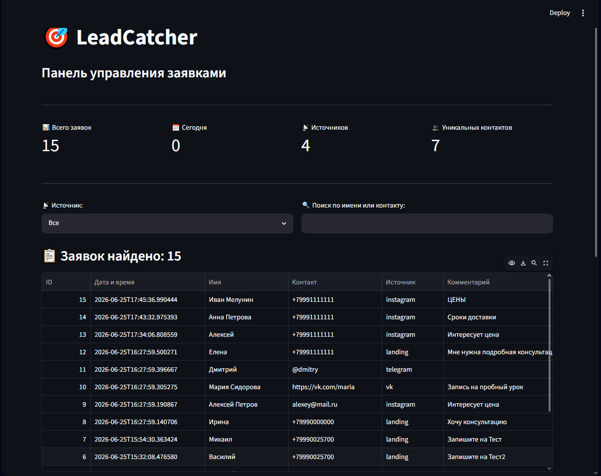
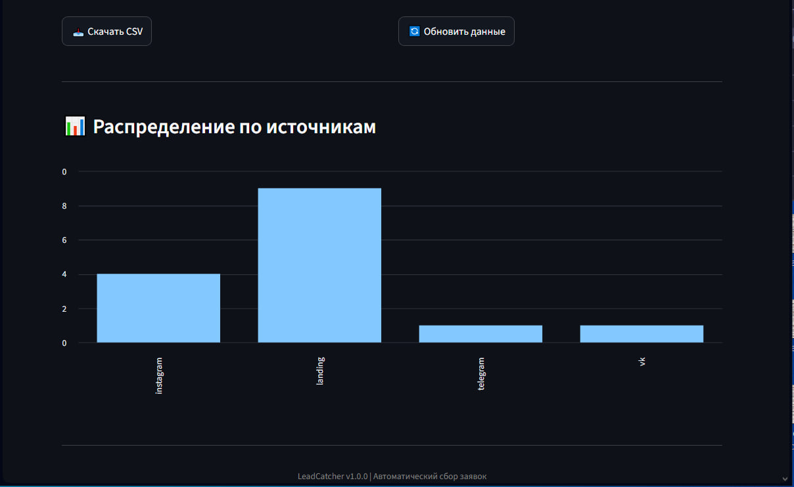

# 🎯 LeadCatcher

  

**MVP-сервис автоматического приёма и обработки заявок (лидов)**

---

📖 О проекте

**LeadCatcher** — это сервис для автоматического приёма заявок с сайтов, социальных сетей и мессенджеров. 

Все заявки автоматически сохраняются в базе данных SQLite, логируются и отображаются в удобной веб-панели управления.

### 🎯 Для кого этот проект?

- ✅ **Для малого бизнеса** — собирайте заявки с лендингов
- ✅ **Для маркетологов** — отслеживайте эффективность источников трафика
- ✅ **Для разработчиков** — простой API для интеграции

---

✨ Возможности

- 📥 **Приём заявок** — REST API endpoint для приёма JSON
- 💾 **Хранение** — SQLite база данных с автосохранением
- 📊 **Админ-панель** — Веб-интерфейс для просмотра заявок
- 📝 **Логирование** — Все события записываются в events.log
- ⚡ **Валидация** — Автоматическая проверка обязательных полей
- 🔍 **Фильтры** — Поиск и фильтрация по источникам
- 📥 **Экспорт** — Выгрузка данных в CSV

---

#🚀 Быстрый старт

1. Установка зависимостей

bash
pip install -r requirements.txt

2. Запуск сервера
Откройте первый терминал:

bash
# Активация виртуального окружения (Windows)
    .\.venv\Scripts\Activate.ps1

# Запуск FastAPI сервера
    uvicorn main:app --reload

Сервер запустится на: http://127.0.0.1:8000

3. Запуск админ-панели
Откройте второй терминал:
bash
# Активация виртуального окружения
    .\.venv\Scripts\Activate.ps1

# Запуск Streamlit
    streamlit run admin.py

Админка откроется автоматически: http://localhost:8501

4. Проверка работы

    Откройте Swagger UI: http://127.0.0.1:8000/docs
    Отправьте тестовую заявку через POST /lead
    Перейдите в Streamlit админку — заявка появится в таблице!

📡 API документация
Основная информация

    Base URL: http://127.0.0.1:8000
    Формат данных: JSON
    Content-Type: application/json

Endpoints
📥 POST /lead — Создание заявки

 Streamlit админка
Веб-интерфейс для удобного просмотра и управления заявками.
Функции админки:

  📊 Статистика — общее количество заявок, за сегодня, по источникам
  🔍 Поиск — фильтрация по имени и контакту
  📡 Фильтр по источнику — выбор конкретного источника трафика
  📥 Экспорт в CSV — выгрузка отфильтрованных данных
  🔄 Автообновление — кнопка обновления данных
  📈 График — распределение заявок по источникам

Как использовать:

    Запустите: streamlit run admin.py
    Откройте: http://localhost:8501
    Просматривайте заявки в реальном времени!

📄 Лицензия
MIT License
